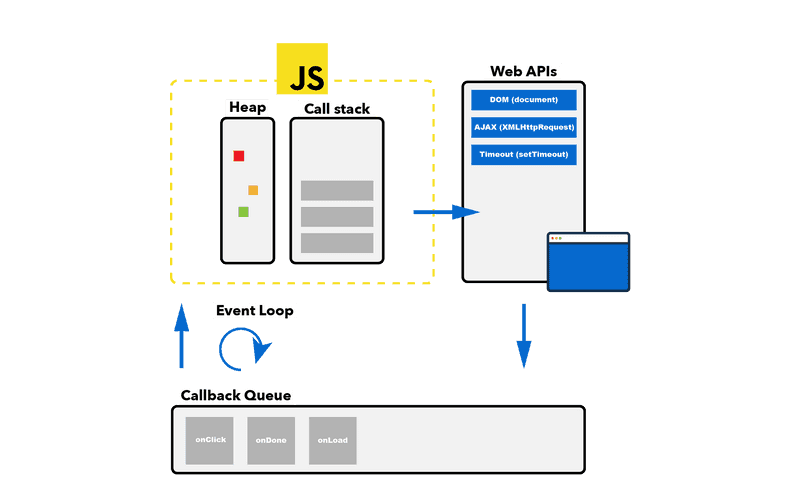
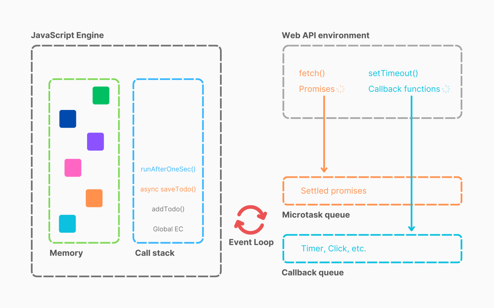
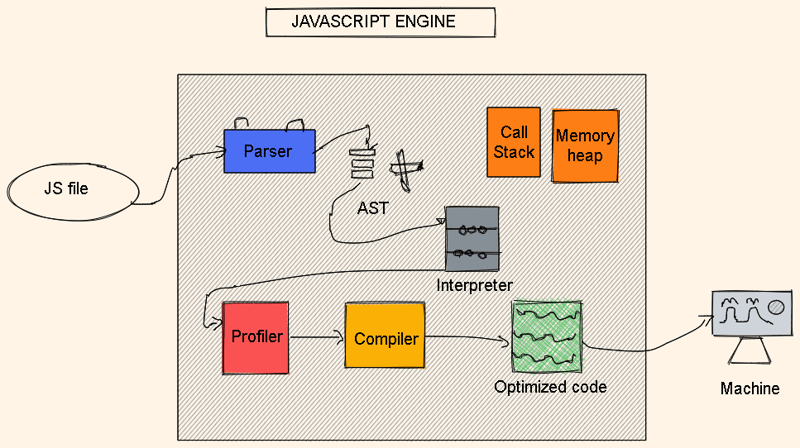
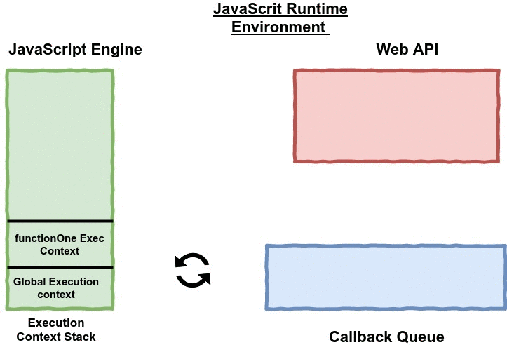
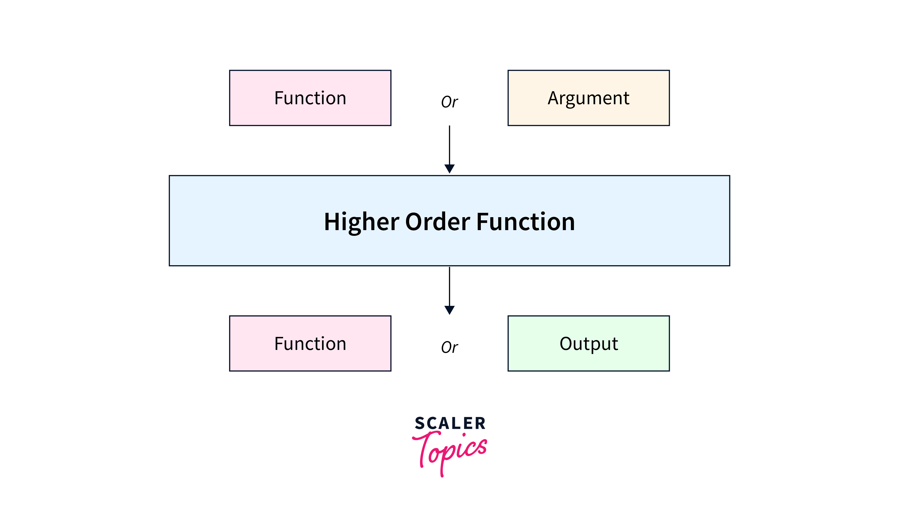
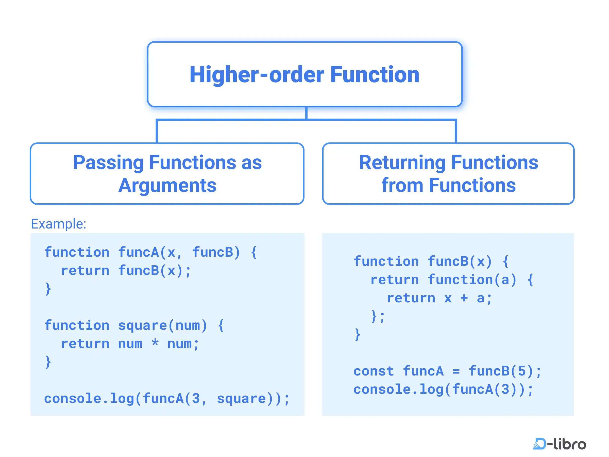
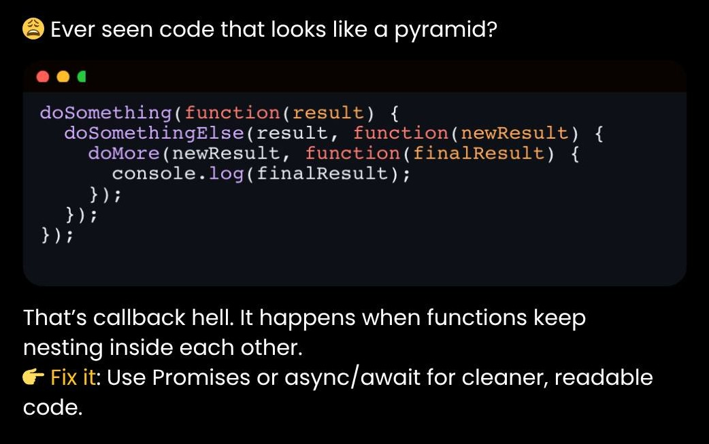
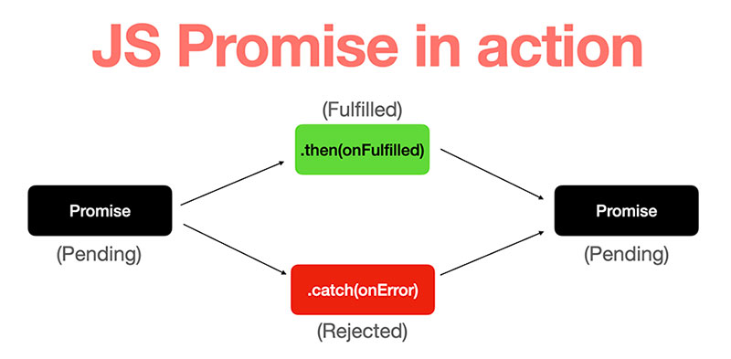
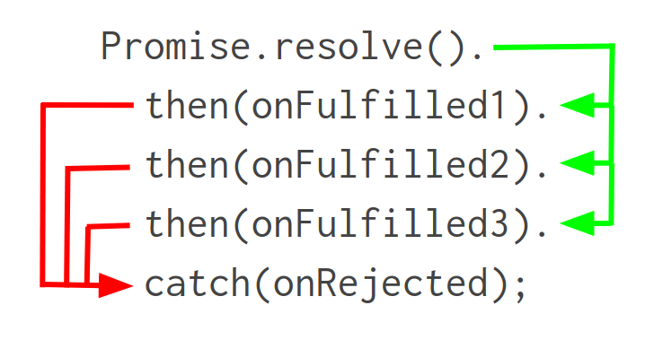

👉 JS-1 How JavaScript Works & Execution Context 👈

Everything in JavaScript happens inside an Execution Context.

Execution Context: 👇

An Execution Context (EC) is the environment where JavaScript code runs, acting like a container that manages variables, functions, and the execution flow, creating a new one for the global scope and each function call, enabling the JS engine (like V8) to track what's accessible and how code runs line-by-line within a scope.

It has two main parts: 👇
the Memory Component (Variable Environment, storing variables/functions) -> key-value pairs.
the Code Component (Thread of Execution).

Javascript is a Synchronous Single-Threaded language.

Explaination: 👇

Single-Thread -> Excecute one command at a time(In specific order - one by one).
Synchronous -> one by one.

👉 JS-2 How JavaScript Code is executed? & Call Stack 👈

Global Execution Context
↓
Function Execution Context
↓
Back to Global Execution Context

Phase -> Memory allocation & Code execution.

Memory allocation: 👇

For variable `var n = 10`, it will allocate like that `n:undefined`.

For function -> `greet: {console.log("Hello World");}`

```javascript
function greet() {
  console.log("Hello World");
}
```

Then execute code in second phase -> Code execution;

🔑 Key Points to Remember

    Memory Component = Stores
    Code Component = Executes
    Functions create new Execution Contexts -> once task done in function, execution context will be deleted.

📚 Call Stack

The Call Stack is a fundamental concept in JavaScript that manages function calls and keeps track of execution contexts. It is part of the execution model of JavaScript, and understanding it is key to knowing how JavaScript code executes.

The Call Stack is a stack data structure that manages function execution contexts.

1. When a function is called, an Execution Context is pushed onto the stack.
2. When the function completes, its Execution Context is popped off the stack.

```javascript
function first() {
  console.log("In first");
}

first(); // Calling the first function
```

Step 1: Initial Call (Global Execution Context)

| Step | Action                     | Call Stack                |
| ---- | -------------------------- | ------------------------- |
| 1    | Start running the program. | `Global EC`               |
| 2    | Call `first()`             | `first() EC`, `Global EC` |

Step 2: first() finishes and pops off the stack:

| Global EC |

Step 3: Program ends with empty stack:

(empty stack)

Call Stack maintain order of execution of execution contexts.

Summary of Other Names:

| Name            | Focus                                            |
| --------------- | ------------------------------------------------ |
| Execution Stack | General term for the stack of execution contexts |
| Function Stack  | Focuses on managing function calls               |
| Control Stack   | Focus on control flow and program execution      |
| Program Stack   | Highlights the program's execution process       |
| Stack Frame     | Describes individual entries in the call stack   |

👉 JS-3 Hoisting in JavaScript(variables & functions) 👈

undefined
not defined

Hoisting is a JavaScript mechanism where variable declarations and function declarations are moved to the top of their containing scope during the compile phase, before the code execution begins. This means that you can use variables and functions before you actually declare them in your code.

However, it’s important to note that only the declarations are hoisted, not the initializations.

🫴 Variable Hoisting

```javascript
console.log(a); // Output: undefined
var a = 5;
console.log(a); // Output: 5
```

🫴 Function Hoisting

```javascript
hello(); // Output: "Hello, world!"

function hello() {
  console.log("Hello, world!");
}
```

👉 JS-4 How functions work in JS ❤️ & Variable Environment 👈

A function in JavaScript is a block of reusable code that performs a specific task.

```javascript
var s = 4;
a();
b();
console.log(s);

function a() {
  var s = 8;
  console.log(s);
}

function b() {
  var s = 12;
  console.log(s);
}
```

👉 JS-5 SHORTEST JS Program window & this keyword 👈

The window and this keyword. Understand how the Global Execution Context is created, global object, and this keyword is created in JS.

JavaScript Engine creates a global object whenever you run any JS code. In the case of browsers, this global object is known as window,

`window === this -> true`

```javascript
var s = 4; //  s - store inside global space

function a() {
  var a = 8; //  a - doesn't store inside global space
}

console.log(window.s);
console.log(this.s);

console.log(window.a); // not defined
```

👉 JS-6 undefined vs not defined in JS 👈

JS is a loosely typed language (weakly typed language). It is a special keyword in JS and it acts as a placeholder for variables until they are assigned any value in them.

Understand the difference between undefined and not defined in JS. Many developers assume that undefined is exactly the same as not defined, but that's not true. undefined is a value in JavaScript and in fact, it also takes up memory space.

👉 JS-7 The Scope Chain, Scope & Lexical Environment 👈

1️⃣ Scope (What can be accessed & where)

Scope defines where a variable or function is accessible in your code.

Types of Scope in JavaScript
| Scope Type | Description |
| ------------------ | --------------------------------------------------- |
| **Global Scope** | Variables accessible everywhere |
| **Function Scope** | Variables accessible only inside a function (`var`) |
| **Block Scope** | Variables accessible inside `{}` (`let`, `const`) |

```javascript
let a = 10; // Global Scope

function test() {
  let b = 20; // Function Scope
  if (true) {
    let c = 30; // Block Scope
    console.log(a, b, c);
  }
  // console.log(c); ❌ Error
}

test();
```

2️⃣ Lexical Environment (Where scope is stored)

Lexical Environment is a local memory along with lexical environment his parents.

A Lexical Environment is the internal structure that stores:

    1. Variables
    2. Function declarations
    3. Reference to its parent (outer) lexical environment

📌 Every Execution Context has a Lexical Environment

Lexical Environment = 👉 Memory Component + Reference to outer environment

```javascript
function outer() {
  let x = 10;

  function inner() {
    let y = 20;
    console.log(x, y);
  }

  inner();
}

outer();
```

Lexical Environments Created

| Function | Variables Stored | Outer Reference |
| -------- | ---------------- | --------------- |
| Global   | `outer`          | null            |
| outer()  | `x`, `inner`     | Global          |
| inner()  | `y`              | outer()         |

3️⃣ Scope Chain (How JS searches variables)

The Scope Chain is the chain of Lexical Environments used to resolve variable names.

📌 When JavaScript needs a variable:

1. Look in current Lexical Environment
2. If not found → go to outer environment
3. Continue until Global scope
4. If not found → ReferenceError

4️⃣ Scope vs Lexical Environment vs Scope Chain

| Concept                 | Meaning                                               |
| ----------------------- | ----------------------------------------------------- |
| **Scope**               | Where variables are accessible                        |
| **Lexical Environment** | Actual data structure storing variables + parent link |
| **Scope Chain**         | Path JavaScript follows to find variables             |


👉 JS-8 let & const in JS Temporal Dead Zone 👈

let and const were introduced in ES6
They are block-scoped, safer, and behave differently during hoisting because of the Temporal Dead Zone.

const and let are in a Temporal Dead Zone until they are initialized some value

1️⃣ let & const Basics

| Feature                   | `let`          | `const`        |
| ------------------------- | -------------- | -------------- |
| Scope                     | Block-scoped   | Block-scoped   |
| Re-declaration            | ❌ Not allowed | ❌ Not allowed |
| Re-assignment             | ✅ Allowed     | ❌ Not allowed |
| Hoisted                   | ✅ Yes         | ✅ Yes         |
| Initialized automatically | ❌ No          | ❌ No          |

2️⃣ What is the Temporal Dead Zone (TDZ)?

📌 Temporal Dead Zone is the time between entering a scope and initializing a let or const variable.

During this time:

The variable exists

But cannot be accessed

Accessing it throws a ReferenceError

3️⃣ TDZ Example (Very Important)

```javascript
console.log(a); // ❌ ReferenceError
let a = 10;
```

Syntax Error, Reference Error & Type Error in JavaScript

1️⃣ Syntax Error ❌ (Code can’t even start)

```javascript
const x = 10;
const x = 20; // ❌ redeclaration with const
```

Key Points

1. Detected before execution
2. JS engine stops immediately

2️⃣ Reference Error ⚠️ (Variable not found)

A Reference Error occurs when you try to access a variable that doesn’t exist in the current scope.

```javascript
console.log(a); // ❌ TDZ
let a = 10;
```

3️⃣ Type Error 🔄 (Wrong operation on a value)

```javascript
const x = 5;
x = 10; // ❌ TypeError
```

👉 JS-9 BLOCK SCOPE & Shadowing in JS 👈

1. What is Block Scope?
   A block is anything inside { ... }, like in if, for, or while.

Variables that are block-scoped --> let & const

They exist only inside the block where they are declared.

```javascript
{
  let x = 10;
  const y = 20;
}

console.log(x); // ❌ Error
console.log(y); // ❌ Error
```

2. var is NOT block-scoped

var is function-scoped, not block-scoped.

var is function-scoped, not block-scoped.

```javascript
{
  var a = 5;
}

console.log(a); // ✅ 5
```

3. What is Shadowing?

Shadowing happens when a variable declared in an inner scope has the same name as one in an outer scope.

```javascript
let x = 10;

{
  let x = 20; // shadows outer x
  console.log(x); // 20
}

console.log(x); // 10
```

❌ Illegal Shadowing

```javascript
let x = 10;

{
  var x = 20; // ❌ SyntaxError: Illegal shadowing
}
```

Key Takeaways 📌

1. let and const → block scoped
2. var → function scoped
3. Shadowing allows inner variables to reuse names
4. var cannot shadow let or const (illegal shadowing)

👉 JS-10 Closures in JS 👈

A closure is a function that retains access to its lexical scope even after the outer function has finished execution.

    A closure is created when a function remembers variables from its outer (lexical) scope, even after the outer function has finished executing.

👉 In short:
A function + its lexical scope = Closure

    Function along with lexical scope bunbled together, it forms a Closure.

```javascript
function a() {
  var x = 10;
  function b() {
    console.log(x);
  }

  return b;
}

var b = a();
b(); //  console.log(x); 10
```

```javascript
function a() {
  var x = 10;
  function b() {
    console.log(x);
  }
  x = 20;

  return b;
}

var b = a();
b(); //  console.log(x); 20
```

b -> Having Function along with lexical scope.

Key Points to Remember 📌

1. Closures remember variables, not values
2. Created every time a function is defined

👉 JS-11 setTimeout + Closures Interview Question 👈

```javascript
function a() {
  var i = 1;
  setTimeout(() => {
    console.log(i);
  }, 3000);

  console.log("First print this");
}

a();
// log - First print this
// log - 1 -> after three seconds
```

```javascript
function a() {
  for (var i = 1; i <= 5; i++) {
    setTimeout(() => {
      console.log(i);
    }, i * 1000);
  }

  console.log("First print this");
}

a();
// 6 6 6 6 6 6
// i - because its held the memory of i, not value of i.
// var - it's not block scope variable
```

```javascript
function a() {
  for (let i = 1; i <= 5; i++) {
    setTimeout(() => {
      console.log(i);
    }, i * 1000);
  }

  console.log("First print this");
}

a();
// 1 2 3 4 5
// because let variable are block scoped - so function has it own memory(identity of i) in closure.
```

```javascript
function a() {
  for (var i = 1; i <= 5; i++) {
    function b(s) {
      setTimeout(() => {
        console.log(s);
      }, s * 1000);
    }
    b(i);
  }

  console.log("First print this");
}

a();
// 1 2 3 4 5
// each func has it own identity of s.
```

One-Line Summary (Interview Gold 🏆)

setTimeout callbacks form closures, and with var they all share the same variable—let or IIFE creates a new scope per iteration.

👉 JS-12 CRAZY JS INTERVIEW ft. Closures 👈

Closures, Data Hiding, Encapsulation, Function Constructors, Garbage Collector, Memory Leaks, Data Privacy with nitty-gritty details along with advantages, and disadvantages of Closure

1️⃣ Data Hiding using Closures
❓ What is Data Hiding?

Restrict direct access to variables → private state

```javascript
function createAccount() {
  let balance = 1000; // private

  return {
    deposit(amount) {
      balance += amount;
    },
    getBalance() {
      return balance;
    },
  };
}

const acc = createAccount();
acc.deposit(500);
console.log(acc.getBalance()); // 1500
```

2️⃣ Garbage Collector (GC)
🔹 What is GC?

Automatically frees memory no longer reachable

🔍 How GC Works (Simplified)

1. Mark Phase → mark reachable objects
2. Sweep Phase → delete unreachable ones

🧠 Modern JS engines use:

1. Mark & Sweep
2. Generational GC
3. Incremental GC

Advantages of Closures ✅

-> Data Hiding / Privacy
-> State Preservation
-> Function Factories
-> Encapsulation
-> Memoization
-> Partial Application / Currying

❌ Disadvantages of Closures

| Issue                 | Explanation                      |
| --------------------- | -------------------------------- |
| 🧠 Memory Consumption | Variables stay in memory         |
| 🐌 Performance        | Extra scope lookup               |
| 🔥 Memory Leaks       | If closures reference large data |
| 😕 Debugging          | Harder to inspect                |
| ⚠️ Overuse            | Bad design if misused            |

👉 JS-13 FIRST CLASS FUNCTIONS ft. Anonymous Functions 👈

1️⃣ Function Statement (Function Declaration)
A Function Statement is a function defined using the function keyword with a name.

🔍 Key Characteristics

    -> Hoisted completely
    -> Can be called before declaration
    -> Name is mandatory
    -> Stored in memory during Creation Phase

```javascript
play(); // ✅ Works

function play() {
  console.log("Cricket");
}
```

2️⃣ Function Expression
A function assigned to a variable.

🔍 Key Characteristics

-> Not hoisted as a function
-> Variable is hoisted as undefined
-> Function created at runtime

```javascript
play(); // ❌ TypeError

var play = function () {
  console.log("Cricket");
};
```

3️⃣ Anonymous Functions
A function without a name.

🔍 Key Characteristics

-> Must be used as expressions
-> Cannot exist alone
-> No self-reference

```javascript
setTimeout(function () {
  console.log("Play Cricket...");
}, 1000);
```

```javascript
function () {} // ❌ Syntax Error
```

4️⃣ Named Function Expression (NFE)
A function expression with a name.

```javascript
var play = function today() {
  console.log("Cricket...");
};

today(); // ❌ ReferenceError
play(); // ✅ Works
// Name today() is local to the function body only
```

5️⃣ First-Class Functions
JavaScript treats functions as first-class citizens.

Meaning functions can:

-> Be assigned to variables
-> Be passed as arguments
-> Be returned from functions
-> Be stored in data structures

```javascript
// Assign to Variable
const fn = () => console.log("Hi");

// Pass as Argument
function play(fn) {
  fn();
}

play(() => console.log("Cricket..."));

// Return from Function
function multiplier(x) {
  return function (y) {
    return x * y;
  };
}

const double = multiplier(2);
double(5); // 10
```

6️⃣ Function Parameters vs Arguments
-> Parameters - Variables defined in the function declaration.
-> Arguments - Actual values passed during function call.

```javascript
function add(a, b) {
  // a, b → parameters
  return a + b;
}

add(10, 20); // 10, 20 → arguments
```

👉 JS-14 Callback Functions in JS ft. Event Listeners 👈

1️⃣ Callback Functions in JavaScript

A callback function is a function passed as an argument to another function, which is invoked later after some operation completes.

```javascript
function play(name, callback) {
  console.log("Hello " + name);
  callback();
}

play("Suresh", function () {
  console.log("Lets Play!");
});
```

🔍 Why Callbacks Exist

-> Handle async operations
-> Avoid blocking the main thread
-> Execute code after completion

Examples:

-> setTimeout
-> Event listeners
-> API calls
-> File I/O (Node.js)

🔹 Types of Callbacks

1️⃣ Synchronous Callback
Executed immediately.

```javascript
[1, 2, 3].map((n) => n * 2);
```

2️⃣ Asynchronous Callback
Executed later.

```javascript
setTimeout(() => {
  console.log("Async");
}, 1000);
```

2️⃣ Event Listeners – How They Work

An event listener waits for a specific event (click, input, scroll) and executes a callback when that event occurs.

```javascript
document.getElementById("btn").addEventListener("click", function submit() {
  console.log("Button Clicked");
});
```

📌 Event listeners are callbacks

🔍 Internals – Behind the Scenes -> Step-by-Step Flow

1️⃣ JS engine executes main code
2️⃣ addEventListener registers callback
3️⃣ Browser stores callback in Web APIs
4️⃣ Event occurs (click)
5️⃣ Callback pushed to Task Queue
6️⃣ Event Loop moves it to Call Stack
7️⃣ Callback executes

```javascript
console.log("Start");

button.addEventListener("click", () => {
  console.log("Clicked");
});

console.log("End");

// Start
// End
// Clicked
```

3️⃣ Blocking the Main Thread 🔹 What is the Main Thread?

The main thread is where:

-> JavaScript executes
-> DOM updates happen
-> Event handling occurs

JS is single-threaded → only one task at a time.

🔹 Blocking the Main Thread – Definition

Blocking means running a long-running synchronous task that prevents:

1. UI rendering
2. User interaction
3. Event callbacks

💡 Callback vs Event Listener

| Aspect    | Callback          | Event Listener    |
| --------- | ----------------- | ----------------- |
| Trigger   | Function call     | Event occurs      |
| Timing    | Immediate / async | Always async      |
| Example   | `setTimeout(fn)`  | `click`, `scroll` |
| Stored in | Stack / Queue     | Browser Web APIs  |

💡 Interview One-Line Answers

Callback 📃

A callback is a function passed to another function to be executed later, commonly used for asynchronous operations.

Event Listener 📃

Event listeners register callbacks that are executed by the event loop when browser events occur.

Blocking Main Thread 📃

Blocking the main thread happens when long synchronous tasks prevent the event loop from processing events and rendering the UI.

🔥 Common Interview Trap

❓ Is JavaScript asynchronous?
✔ No — JavaScript is single-threaded, but the runtime environment makes it async.

👉 JS-15 Asynchronous JavaScript & EVENT LOOP 👈

🔁 What is the Event Loop?
📝 One-Line Interview Answer

The event loop continuously checks the call stack and executes microtasks and macrotasks in order to handle asynchronous operations without blocking the main thread.

The Event Loop is a mechanism that coordinates:

-> Call Stack
-> Web APIs
-> Callback / Task Queue
-> Microtask Queue

to allow JavaScript (single-threaded) to perform non-blocking asynchronous operations.

💡 JavaScript itself is synchronous.
The Event Loop is part of the JS runtime (Browser / Node.js), not the JS engine.

🧱 Components of the Event Loop

1️⃣ Call Stack

1. Executes JS code line by line
2. Uses LIFO (Last In, First Out)

```javascript
function a() {
  b();
}
function b() {
  console.log("Lets Play Cricket 🏏 eeE...");
}
a();

// Stack flow:
// a -> b -> console.log → pop → pop
```

2️⃣ Web APIs (Browser)

Provided by the browser, not JS:

1.  setTimeout
2.  DOM events
3.  fetch
4.  setInterval

They handle async tasks off the main thread.

3️⃣ Callback / Task Queue (Macrotask Queue)

Holds callbacks from:

1. setTimeout
2. setInterval
3. DOM events
4. MessageChannel

4️⃣ Microtask Queue (High Priority)

Holds:

1. Promise.then / catch / finally
2. queueMicrotask
3. MutationObserver

📌 Microtasks run BEFORE macrotasks

5️⃣ Event Loop (The Orchestrator)

Continuously:

1. Checks if Call Stack is empty
2. Executes all Microtasks
3. Executes one Macrotask
4. Repeats



🔄 Event Loop Flow (Visual)

Call Stack
↓
Web APIs
↓
Microtask Queue ← (Highest Priority)
↓
Callback Queue (Macrotask)
↓
Event Loop → Call Stack

🔥 Core Example (Must-Know)

```javascript
console.log("Start");

setTimeout(() => {
  console.log("Timeout");
}, 0);

Promise.resolve().then(() => {
  console.log("Promise");
});

console.log("End");
```

Console

```powershell
Start
End
Promise
Timeout
```


Why?

1️⃣ Synchronous code runs first
2️⃣ Promise → Microtask Queue
3️⃣ setTimeout → Macrotask Queue
4️⃣ Microtask runs before Macrotask

🧠 Step-by-Step Execution

| Step | Action                    |
| ---- | ------------------------- |
| 1    | `Start` logged            |
| 2    | `setTimeout` → Web API    |
| 3    | Promise → Microtask Queue |
| 4    | `End` logged              |
| 5    | Call stack empty          |
| 6    | Microtasks executed       |
| 7    | Macrotask executed        |

⚠️ Important Rule (Interview Favorite)
✅ Microtasks drain completely before any Macrotask executes

🔴 Starvation Problem (Microtask Hell)

```javascript
function recurse() {
  Promise.resolve().then(recurse);
}
recurse();
```

❌ Macrotasks never run
❌ UI freezes

➡️ Microtask starvation

⏱ setTimeout(0) is NOT zero

```javascript
setTimeout(() => console.log("Timer"), 0);
```

Why delay?

-> Browser minimum delay (~4ms)
-> Waits for call stack
-> Microtasks must finish

🧠 Why Event Loop Matters

Prevents UI freezing

Enables async programming

Explains:

-> async/await
-> Promises
-> Callbacks
-> Event listeners

🧩 Common Misconceptions

❌ JS is multithreaded
✔ JS is single-threaded, runtime is async

❌ setTimeout runs exactly on time
✔ Runs after stack + microtasks

👉 JS-16 JS Engine EXPOSED Google's V8 Architecture 👈

JavaScript Runtime Environment

A JavaScript Runtime Environment is everything needed to execute JavaScript.

1️⃣ What a JavaScript Runtime Environment Is

JavaScript Engine

- Web / System APIs
- Event Loop
- Callback / Task Queues

2️⃣ Core Components

🧠 1. JavaScript Engine

Executes JavaScript code.

Popular engines:

1.  V8 → Chrome, Node.js
2.  SpiderMonkey → Firefox
3.  JavaScriptCore → Safari

🌐 2. APIs (Provided by the Host)

These are NOT part of JavaScript.

🔁 3. Event Loop

Handles asynchronous, non-blocking execution.

The event loop:

-> Monitors queues
-> Pushes callbacks to the call stack when it’s empty

JavaScript itself is single-threaded
➡️ Async behavior is enabled by the runtime.



Google’s V8 is a high-performance JavaScript and WebAssembly engine written in C++.

V8 Pipeline

JavaScript
↓
Parser → AST
↓
Ignition (Bytecode Interpreter)
↓
TurboFan (Optimized Machine Code)
↺ (Deopt if assumptions break)

1️⃣ From Source Code to Execution

Step 1: Parsing

-> JS source is tokenized and parsed into an AST (Abstract Syntax Tree).
-> Syntax errors are caught here.

Step 2: Ignition (Interpreter)

->The AST is compiled into bytecode by Ignition.
-> Bytecode starts executing immediately → fast startup.
-> While running, Ignition collects profiling data (types, hot paths).

2️⃣ TurboFan — The Optimizing JIT Compiler

Bytecode + runtime feedback → TurboFan

3️⃣ Memory Management & Garbage Collection



👉 JS-17 TRUST ISSUES with setTimeout() 👈

1️⃣ What setTimeout Actually Does

Call Stack
↓
Browser / Node Timer API
↓ (minimum delay)
Task Queue (macrotask)
↓ (only when stack is empty)
Call Stack

⛔ If the call stack is busy → your callback waits longer

2️⃣ Call Stack Blocking (Most Common Bug)

```javascript
console.log("Lets Play");

setTimeout(() => console.log("Bowled"), 1000);

console.log("Batting");

const start = Date.now();
while (Date.now() - start < 3000) {} // blocks thread

console.log("Bowling");
```

Output:

```powershell
Lets Play
Batting
Bowling
Bowled // log After 3 second
```

Why?

-> JS is single-threaded
-> Event loop can’t run callbacks while stack is busy

3️⃣ Microtasks Jump the Line 😤

```javascript
setTimeout(() => console.log("timeout"), 0);

Promise.resolve().then(() => console.log("promise"));
```

```powershell
promise
timeout
```



👉 JS-18 Higher-Order Functions ft. Functional Programming 👈

1️⃣ What Is a Higher-Order Function?

A Higher-Order Function is a function that:

✔ Takes another function as an argument
✔ Returns a function
✔ Or both

Because in JavaScript, functions are first-class citizens.



2️⃣ Functions as First-Class Citizens

That means functions can be:

-> Assigned to variables
-> Passed as arguments
-> Returned from other functions

```javascript
const play = () => "Cricket";
const now = when;

now(); // "Hello" -> This ability enables HOFs.
```

Function Programming - HOF

1. Higher-Order Functions accept or return functions
2. They enable Functional Programming
3. map, filter, reduce are HOFs
4. FP = composition, immutability, purity
5. Cleaner, safer, more expressive code

<!--  -->



👉 JS-19 map, filter & reduce 👈

1️⃣ map() → Transform

Takes every element and transforms it - Returns a new array, Does not mutate original

2️⃣ filter() → Select

Keeps elements that pass a condition - Length may change, Returns a new array

3️⃣ reduce() → Combine

Reduces an array to a single value

```javascript
const arr = [
  {
    name: "sur",
    age: 25,
  },
  {
    name: "ani",
    age: 25,
  },
  {
    name: "ayeshu",
    age: 28,
  },
  { name: "kevin", age: 34 },
];
const ageWiseCount = arr.reduce((acc, curr) => {
  if (acc?.[curr.age]) {
    acc[curr.age] = acc?.[curr.age] + 1;
  } else {
    acc[curr.age] = 1;
  }
  return acc;
}, {});

// Find people who are age less than 30 (Using filter, reduce)
const output1 = arr.filter((v) => v.age < 30).map((e) => e.name);

const output2 = arr.reduce((acc, curr) => {
  if (curr.age < 30) acc.push(curr.name);

  return acc;
}, []);

console.log(ageWiseCount);
console.log(output1);
console.log(output2);
```

Output

```powershell
// ageWiseCount
{
    "25": 2,
    "28": 1,
    "34": 1
}
// People
[
    "sur",
    "ani",
    "ayeshu"
]
[
    "sur",
    "ani",
    "ayeshu"
]
```

One Table to Rule Them All

| Method | Purpose   | Output                  |
| ------ | --------- | ----------------------- |
| map    | Transform | New array (same length) |
| filter | Select    | New array (≤ length)    |
| reduce | Combine   | Any value               |

👉 JS-20 Callback Hell 👈

1️⃣ Callback
What is a Callback?

A callback is a function passed to another function to be executed later.

```javascript
function fetchData(callback) {
  setTimeout(() => {
    callback("Data received");
  }, 1000);
}

fetchData((data) => {
  console.log(data);
});
```

Why Callbacks Exist

-> JS is asynchronous
-> Long tasks (I/O, timers) shouldn’t block the thread
-> Callbacks run after the task finishes

2️⃣ Callback Hell 😵 (Pyramid of Doom)
The Problem

```javascript
getUser(id, (user) => {
  getOrders(user, (orders) => {
    getDetails(orders, (details) => {
      process(details, (result) => {
        console.log(result);
      });
    });
  });
});
```

This leads to:
❌ Deep nesting
❌ Hard-to-read code
❌ Hard error handling
❌ Hard debugging

📛 This structure is called Callback Hell.

Why It Happens

Each async step depends on the previous one
Control flow becomes nested instead of linear

3️⃣ Inversion of Control (The Real Danger ⚠️)
What It Means

Inversion of Control (IoC) happens when you give control of your code to another function/library.

With callbacks:

1. You hand over your function
2. You trust it to call:
   -> At the right time
   -> Once (not twice)
   -> With correct data
   -> With proper error handling

```javascript
setTimeout(() => {
  // Will it run once? On time? With errors?
}, 1000);
```

4️⃣ How Promises Fix These Issues ✅

Promise = You Keep Control

➡️ Control flow returns to you

```javascript
getUser(id)
  .then((user) => getOrders(user))
  .then((orders) => getDetails(orders))
  .then((result) => console.log(result))
  .catch((err) => console.error(err));
```

5️⃣ async / await (Best of Both Worlds 🏆)

Reads like synchronous code
Runs asynchronously
No inversion of control issues

6️⃣ Mental Models (Interview Gold 🧠)

Callback

“A function executed later by another function.”

Callback Hell - Pyramid of Doom

“Deeply nested callbacks that destroy readability and control.”

Inversion of Control

“Losing control over when and how your code executes.”

TL;DR ⚡

- Callbacks enable async behavior
- Callback Hell = unreadable nested async code
- Inversion of Control = giving control to someone else
- Promises & async/await fix these problems



👉 JS-21 Promises 👈

Promises is the new way of handling asynchronous operations in JavaScript.

Promises are the foundation of modern async JavaScript.
They solve callback hell and inversion of control by giving you back control.

1️⃣ What Is a Promise?

A Promise is an object that represents the eventual result of an asynchronous operation.

It’s a placeholder for a value that will be available later.

2️⃣ Promise States (Very Important 🧠)

A Promise can be in only one of these states:

```powershell
pending   → fulfilled (resolved)
         → rejected
```

🔒 Immutable once settled
➡️ Can never change again

3️⃣ Consuming a Promise

```javascript
promise
  .then((result) => console.log(result))
  .catch((error) => console.error(error))
  .finally(() => console.log("Always runs"));
```

Why This Is Better Than Callbacks

✔ Flat structure
✔ Single error channel
✔ Guaranteed one-time resolution



4️⃣ Promise Chaining 🔗

```javascript
fetchUser()
  .then((user) => fetchOrders(user))
  .then((orders) => processOrders(orders))
  .then((result) => console.log(result))
  .catch((err) => console.error(err));
```

Each then:

- Receives previous result
- Returns a new Promise
- Avoids nesting



👉 JS-22 Creating a Promise, Chaining & Error Handling 👈

1️⃣ Creating a Promise

```javascript
const myPromise = new Promise(function (resolve, reject) {
  const success = true;

  if (success) {
    resolve("Task completed successfully");
  } else {
    reject("Task failed to complete");
  }
});
```

-> resolve(value) → Promise is fulfilled
-> reject(error) → Promise is rejected

2️⃣ Consuming a Promise (then & catch)

```javascript
const myPromise = new Promise();

myPromise
  .then(function (res) {
    console.log("res:", res);
  })
  .catch(function (err) {
    console.log("err: ", err);
  });
```

-> .then() runs when the promise resolves
-> .catch() runs when it rejects

3️⃣ Promise Chaining

Each .then() can return a value or another Promise.

```javascript
function testPromise(value) {
  return new Promise((resolve, reject) => {
    resolve(value);
  });
}

const myPromise = testPromise("Hi");

myPromise
  .then(function (res) {
    console.log(res);
    return res;
  })
  .then(function (data) {
    return testPromise(`${data} Suresh`);
  })
  .then(function (data) {
    console.log(data);
  })
  .catch(function (err) {
    console.log("err: ", err);
  });
```

👉 Whatever you return from .then() is passed to the next .then().

4️⃣ Error Handling in Chains

If any promise fails, control jumps to .catch().

```javascript
function testPromise(value) {
  return new Promise((resolve, reject) => {
    const success = false;

    if (success) resolve(value);
    else reject("Failed");
  });
}

const myPromise = testPromise("Hi");

myPromise
  .then(function (res) {
    console.log(res);
    return res;
  })
  .then(function (data) {
    return testPromise(`${data} Suresh`);
  })
  .then(function (data) {
    console.log(data);
  })
  .catch(function (err) {
    console.log("err: ", err);
  });
```

5️⃣ Multiple .catch() (Advanced)

A .catch() can recover and continue the chain.

```javascript
function isNumber(value) {
  return new Promise((resolve, reject) => {
    if (!isNaN(value)) resolve(`${value} is Valid Number`);
    else reject(`${value} is not an number`);
  });
}

const numberPromise = isNumber("Suresh");

numberPromise
  .then((res) => console.log(res))
  .catch((err) => {
    console.log("Err: ", err);
  })
  .then((res) => {
    return isNumber("1");
  })
  .then((res) => console.log(res))
  .catch((err) => {
    console.log("Err: ", err);
  });
```
